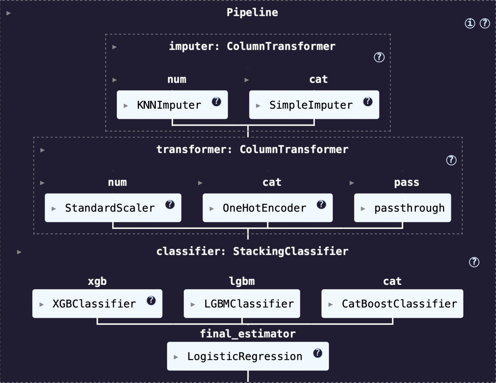

# 🚀 Spaceship Titanic - 生存預測機器學習專案(模型準確率排名前17%)

## 📘 專案簡介
本專案參與的是 Kaggle 比賽 [Spaceship Titanic](https://www.kaggle.com/competitions/spaceship-titanic)，
目的是根據太空旅客的基本資訊與消費行為，預測他們是否在神秘事故中被「Transported」到另一個維度，
經過了資料探索、相關分析與建模後，我們成功建立了一個準確率高達0.802的模型。

---

## 🎯 專案目標
- 針對每位乘客，根據其基本資訊預測 `Transported`欄位（二元分類）。
- 進行數據探索，了解哪些資訊使乘客更容易被傳送。
- 運用機器學習模型進行特徵工程、訓練與優化。
- 比較不同模型效能，並進行交叉驗證與提交。

---

## 📂 資料集概覽

| 資料欄位        | 說明                     |
|-----------------|--------------------------|
| PassengerId     | 乘客編號|
| HomePlanet      | 乘客的原始星球             |
| CryoSleep       | 是否冷凍睡眠（True/False）|
| Cabin           | 艙房位置（分艙、甲板等）  |
| Destination     | 目的地行星               |
| Age             | 年齡                     |
| VIP             | 是否為貴賓               |
| RoomService、FoodCourt、ShoppingMall、Spa、VRDeck | 花費紀錄 |
| Name            | 姓名           |
| Transported     | 是否被傳送，**目標欄位**（True/False）|

---

## 📊 資料探索與分析
- 大多數欄位皆有缺失值，目標欄位沒有偏態現象
- 透過直方圖和箱型圖觀察到，年紀輕的乘客(30以下)更容易被傳走
- 大多數消費者的花費不會太高(<=10000元)，被傳送的大部分都是花費較少的乘客
- 進行冷凍睡眠的人有很大比例都被傳走了，少數人為VIP

## ⚒️ 資料處理與特徵工程
- **缺失值處理**：數值欄位使用KNNImputer，類別欄位使用眾數填補
- **資料偏態**：將消費型欄位進行對數轉換，使其呈現常態分布
- **資料標準化**：數值型欄位進行標準化，類別型欄位進行獨熱編碼
- **欄位拆解**：Cabin 拆為 Deck / Num / Sid
- **欄位分組**：將年齡、艙位編碼進行分組
- **特徵擴充**：消費總額是使否消費 
---

## 🔬 建模與實驗
### 使用的模型：
- Logistic Regression
- KNN
- SVM
- Random Forest
- XGBoost（最佳表現）
- LightGBM
- CatBoost
- Voting Ensemble、Stacking Ensemble(集成式學習)

### 評估指標：
- Accuracy
- Cross-validation score
- Kaggle submission accuracy

---

## 📈 最佳模型成果
- 模型：Stacking(base = xgboost、LGBM、Catboost, final = Logistic)
- 交叉驗證準確率：0.82116
- Kaggle Public Leaderboard 分數：0.80266

---

